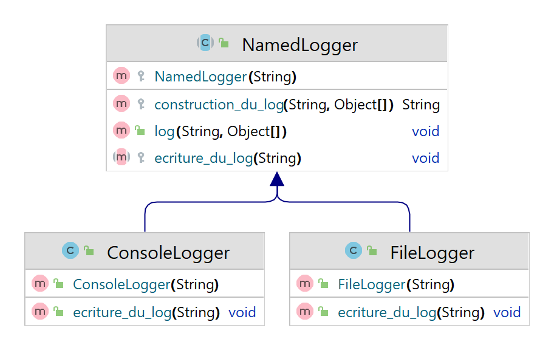

# Compte Rendu du TP 1 : Patrons de Conceptions

Noms des étudiants du binôme :
- LAQUEUVRE Damien
- MOULON Florent

## Exercices 1
> Le patron de conception utilisé ici est un patron composite, 
> L'interface composante est l'interface `MobileObject` , la feuille est la classe `Wheel` et les composites sont tous les `Vehicle`. Ces deux dernières imlémentant `MobileObject`, la classe `SimpleBike`, hérite de `Bike` elle même héritant de `Vehicle` possède des roues.

(ajouter diagramme de classe)
> Pour la classe `TagAlongBike`, elle hérite de `SimpleBike` et à un attribut `SimpleBike` correspondant au vélo de l'enfant. 
> Nous n'avons rien à changer sur les algorithmes, car les fonctions calculent déjà leur valeur en prennant en compte chacunes des composantes (en sommant pour la masse et donc pour le calcul de la vitesse). 

## Exercices 2

> La méthode `getVelocity()` utilise le **patron de conception itérateur** pour parcourir les composants d'un véhicule.
> L'avantage de ce patron est qu'il permet de parcourir une collection d'objets sans exposer sa structure interne.
> Ainsi tant qu'une class implémente l'interface `Iterable`, on peut la parcourir avec un itérateur et donc l'utiliser dans la méthode `getVelocity()` sans avoir à modifier son implémentation.
> 
> On change la structure de donnée utilisée pour stocker les composants d'un `Vehicule`
> - de : ``protected final Set<MobileObject> components = new HashSet<>();``
> - à  : ``protected final List<MobileObject> components = new ArrayList<>();``
> 
> Nous n'avons pas besoin de modifier l'implementation de la méthode ``getVelocity()`` car elle utilise déjà un itérateur pour parcourir les composants du véhicule.
> Elle est donc indépendante de la structure de donnée utilisée pour stocker les composants puisques les deux classes (`Set` et `List`) implémentent l'interface ``Iterable``.

> Pour construire un pattern singleton nous avons écrit le code suivant. 
```java
public final class Clock {
    private static Clock c;
    private final int time = new Random().nextInt(25);

    // On créé un constructeur privé, qui est accessible seulement à l'intérieur de
    // la classe. Le singleton est le seul à pouvoir s'instancier (depuis getTime())
    private Clock() {
        super();
    }

    /**
     * Random integer between 0 and 24 inclusive.
     */
    public final static int getTime() {
        // On vérifie si un instance de Clock à déjà été créé
        if (Clock.c == null) {
            // Si ce n'est pas le cas nous la créons
            Clock.c = new Clock();
        }
        // Puis on return time
        return c.time;
    }
}
```

## Exercices 3
// mettre le code

## Exercices 4
#### Les classes Bike et Wheel, appartiennent-elles au même paquetage[^3] ? Quel type de dépendance y a-t-il entre les deux classes ? Cette dépendance adhère-t-elle aux bonnes pratiques de conception ?
> Les classes `Bike` et `Wheel` n'appartiennent pas au même paquet age. En effet :
> - `Bike` appartient au paquet `fr.polytech.sim.cycling`
> - alors que `Wheel` appartient au paquet `fr.polytech.sim.transport`
> 
> La dépendance entre les deux classes est une dépendance de composition cyclique. 
> En effet, `Wheel` a une référence vers `Bike` pour obtenir l'effort appliqué sur la roue. 
> Et `Bike` a une référence vers `Wheel` pour pouvoir calculer la masse du vélo.
> 
> Cette dépendance n'adhère pas aux bonnes pratiques de conception car elle crée une forte dépendance (interdépendance) entre les deux classes.

#### Quelle fonctionnalité de la classe Bike utilise la classe Wheel ? Y a-t-il déjà une abstraction de la classe Bike qui isole cette fonctionnalité ? Dans quel paquetage se trouve cette abstraction ?
> La classe `Bike` utilise la méthode `getMass()` et `getVelocity()` de la classe `Wheel` pour calculer la masse du vélo.
> Cette fonctionalité est absstraite dans la classe abstraite `Vehicule` qui se trouve dans le paquetage `fr.polytech.sim.transport`.

#### Proposez, et réalisez, une solution pour casser la dépendance cyclique entre les classes Bike et Wheel.
> Pour casser la dépendance cyclique entre les classes `Bike` et `Wheel`, nous allons utiliser une abstraction de la fonctionalité `getPush()` de `Bike` (qui est utilisée par `Wheel`) que nous mettrons dans le paquetage `transport`.
> Ainsi la classe ``Bike`` sera dépendante du paquet `transport` mais `Wheel` ne sera plus dépendante du paquet `cycling`.
> 
> Par chance, cette abstraction existe déjà dans la classe abstraite `Vehicule` qui se trouve dans le paquetage `fr.polytech.sim.transport`.
> Il nous suffit donc de mofiier la variable `drive` de ``Wheel`` pour qu'elle soit de type `Vehicule` et non plus de type `Bike`.
> Ce changement suffis car `Vehicule` contient déjà la méthode `getPush()` qui est utilisée par `Wheel` et `Bike` implémente déjà cette méthode.


## Exercices 5
> On utilise le patron de conception patron de méthode pour centraliser l'étape commune des 2 classes à un seul endroit.
> Pour ce faire, on découpe la méthode `log()` en 2 méthodes : `construction_du_log()` et `ecriture_du_log()`. 
> 
> La méthode ``log()`` devient alors notre **patron de méthose** qui appelle les 2 méthodes `construction_du_log()` et `ecriture_du_log()` :
> L'étape commune de fabrication du message final est donc centralisée dans la méthode `construction_du_log()` et implémenter directement dans las classe abstraite ``NamedLogger``.
> 
> 
> La méthode `ecriture_du_log()` est quant à elle abstraite et doit être implémentée par les classes filles.
> On remplace donc la méthode `log()` des classes `FileLogger` et `ConsoleLogger` par la méthode `ecriture_du_log()`.
> 
> ```java
>    public void log(String format, Object... args) {
>        String message = this.construction_du_log(format);
>        this.ecriture_du_log(message);
>    }
>
>    protected String construction_du_log(String format, Object... args) {
>        String entry = String.format(format, args);
>        String message = String.format("%s\t%s\n", this.name, entry);
>
>        return message;
>    }
>
>    abstract protected void ecriture_du_log(String message);
>```
> 


## Exercices 6

> Nous centralisons dans l'interface `Logger` une méthode statique `getLogger()` qui définit le choix de la réalisation de log.

```java
    static Logger getLogger(String name) {
        return new ConsoleLogger(name);
    }
```

> La différence avec le pattern Singleton est que, si nous avons une méthode statique à laquelle nous faisons appel, notre pattern instancie autant de classe qu'il y a d'appel. 

## Exercices 7


## Exercices 8
#### Quel patron de conception suit la classe Context vis-à-vis l'outil ServiceLoader ?
> La classe Context adapte l'outil ```ServiceLoader``` grâce au patron de conception **adaptateur avec délégation**.

#### Utilisez la classe utilitaire Context pour injecter un objet de type Bike dans la simulation, au lieu de l'instancier avec le mot clef new. Changez la classe injectée de SimpleBike à TagAlongBike.
> Dans la classe `BikeSimulator`, on utilise la classe `Context` pour injecter un objet de type `Bike` dans la simulation :
> ```java
> Context ctx = new Context();
> Bike bike = ctx.inject(Bike.class);
>```
> 
> Puis on modifie dans le fichier ```fr.polytech.sim.cycling.Bike``` la classe pour mettre la classe `TagAlongBike` à la place de `SimpleBike`.

#### Peut-on avoir plusieurs lignes dans le fichier fr.polytech.sim.cycling.Bike ? À quoi correspond chaque de ces lignes ?
> Oui, on peut avoir plusieurs lignes dans le fichier `META-INF/services/fr.polytech.sim.cycling.Bike`.
> Les différentes lignes fon réfèrence à différentes implémentations de l'interface `Bike`.
> Lorsque le ``ServiceLoader`` est utilisé pour charger les services, il retourne un itérateur sur toutes les classes listées dans le fichier.


## Exercices 9
#### Observez le type de retour de la méthode injectAll(). Quel patron de conception propose cette méthode pour parcourir tous les objets d'un type donné disponibles dans le contexte applicatif ?
> La méthode `injectAll(Class<T> klass)` retourne un `Iterator<T>`, 
> elle propose donc le patron de conception **itérateur** pour parcourir tous les objets d'un type donné disponibles dans le contexte applicatif.

#### Réaliser cette méthode en cohérence avec son objectif décrit ci-dessus et détaillé dans sa documentation.
> Il nous suffit d'ajouter une nouvelle ligne contenant ``fr.polytech.sim.cycling.TagAlongBike`` au fichier ``META-INF/services/fr.polytech.sim.cycling.Bike`` qui contient donc :
> ````
> fr.polytech.sim.cycling.SimpleBike
> fr.polytech.sim.cycling.TagAlongBike
> ````

#### Modifiez la simulation de vélo pour utiliser cette même méthode afin de simuler tous les types de vélo presénts dans la configuration. Modifiez la configuration pour simuler et SimpleBike et TagAlongBike.
> On modifie la simulation de vélo pour utiliser la méthode `injectAll()` afin de simuler tous les types de vélo présents dans la configuration.
> 
> On ajoute donc le code suivant dans ``BikeSimulator``:
> ```java
>        Iterator<Bike> bikes = Context.injectAll(Bike.class);
>
>        while (bikes.hasNext()) {
>            Bike bike = bikes.next();
>            System.out.println("Simulating " + bike.getClass().getSimpleName());
>            this.logger.log("Bike's speed %.2f Km/h.", bike.getVelocity());
>            this.logger.log("Bike's mass %.2f Kg.", bike.getMass());
>        }
>```
> 
> Il a également fallu coder la méthode ``injectAll()`` dans la classe ``Context``:
> ```java
>     public static <T> Iterator<T> injectAll(Class<T> klass) {
>        ServiceLoader<T> serviceLoader = ServiceLoader.load(klass);
>        return serviceLoader.iterator();
>    }
>```